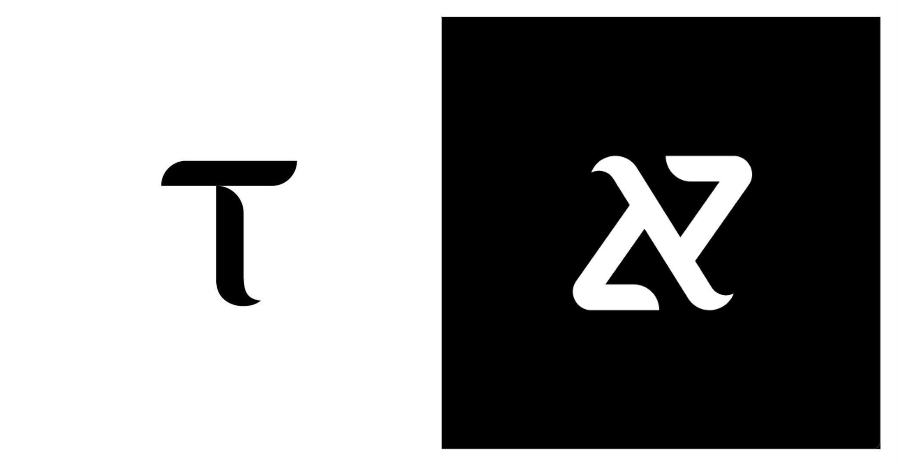
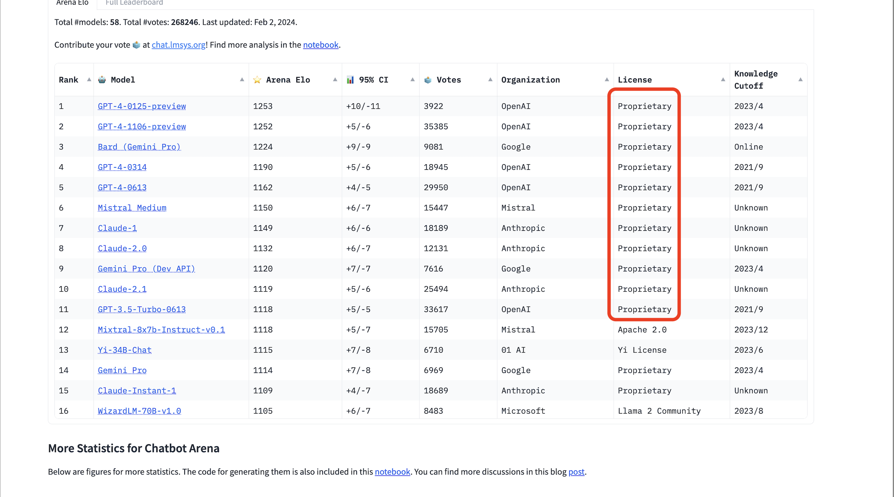

<div align="center">

# **Distributed Training Subnet** <!-- omit in toc -->
[](https://discord.gg/bittensor)
[](https://opensource.org/licenses/MIT) 

</div>

---



# Exploring New Frontiers : א・hivemind・25

## Essential Guide for Bittensor Enthusiasts:
Beginners to Bittensor are encouraged to start with the basics by visiting the [Bittensor official site](https://www.bittensor.com). This foundational step is crucial for understanding the innovative landscape Bittensor is shaping.

## Launching Subnet Hivemind-25: Our Quest:
Our ambition is to train the largest ever Large Language Model (LLM), harnessing the unique strengths of the Bittensor network's and in a completely decentralised manner. Our approach is rooted in transparency and open collaboration in the AI space. 
## The Significance of Our Endeavor:
An overview of the "LMSYS Chatbot Arena Leaderboard" highlights the predominance of proprietary models. Our endeavor seeks to challenge this norm, ushering in a new phase of open and inclusive AI development practices.




## What we’ve done 
After a period of intense experimentation and evaluation, we have successfully trained our inaugural model (tinygpt2), marking the first ever incentivized distributed training over the internet (incentivized with TAO). 

We are currently in our next project phase  (training a slightly larger GPT2 model - 677m params), and we invite you to join our mission by dedicating your computational resources towards this training run. All you have to do is run a miner, and it may just change the world.

## Live Status (Friday 16th Feb, 2024)
Done : Train TINYGPT  
* In Progress : GPT2 Training Run - 667m Params
* Roadmap (Dropping 16 Feb 2024) - **see below**
    * **Roadmap.Now** : Upgrade/stabilise subnet architecture (Due 02/24/24)
        * Outcomes : Improves all aspects of subnet operations, validaton, mining experience and stability. Much more details to come.  
    * **Roadmap.Next** : Train even larger model (still deciding which one)
    * **Roadmap.Later** : Fintune and Serve LLM on bittensor
* Office Hours (Timing TBC - Dropping 16 Feb 2024) - **see below**
    * **Live Guided Mining from Scratch on Hivemind (S25) - Fri 23 Feb, time TBC - Beginner Friendly**
* Step-by-Step Guide to Mining on Hivemind (Dropping 16 Feb 2024) - **See below**
    * : See [Running a Miner on Testnet](https://github.com/bit-current/DistributedTraining/edit/main/docs/running_25_on_testnet.md).


## Known Issues (fix in progress)
* suddenly diminishing miner incentive - (fixed pushed Thursday 15th Feb - 7:30EST - We need your feedback on this one)
* load_state_from_peers errors (Should be fixed - let us know if you still see it, we're not 100% sure on this one)
* Timeout errors - on the list (not occurred recently, but let us know if it shows up again!)
* All_reduce errors - on the list

## Frequently Asked Questions
* What are the minimum requirements to run a validator? A GPU with a minimum of 16GB RAM e.g. RTX A4000
* What are the minimum requirements to run a miner? A GPU with a minimum of 16GB RAM e.g. RTX A4000

# Running a Miner on HiveMind : A Step-by-Step Guide 

## Running a Miner on Testnet
For detailed instructions on how to run a miner on the testnet, please refer to the following documentation:
[Running a Miner on Testnet](https://github.com/bit-current/DistributedTraining/edit/main/docs/running_25_on_testnet.md)

## Running a Miner on Hivemind
### Prerequisites
Before you start, ensure your system meets the following requirements:

* Your machine meets the minimum hardware requirements for mining on subnet 25: miner/validator GPU - 16GB RAM e.g. RTX A4000.
* You have the requisite amount of tao in your wallet for registration fees (approx. 0.00001 Tao at the time of writing).
* This repository requires python3.8 or higher.

### Setting Up
* Clone the Repository: Start by cloning the Distributed Training repository.  

    ```git clone https://github.com/bit-current/DistributedTraining```  
* Navigate to the Repository: Change your directory to the cloned repository.  
    ```cd DistributedTraining```  
* Install Dependencies: Install all necessary dependencies and run post-install scripts.        
    ```pip install -e . && python post_install.py```    
 * You also need to install pm2.  
 On linux:  
    ```sudo apt update && sudo apt install jq && sudo apt install npm && sudo npm install pm2 -g && pm2 update```  
 On macOS:   
    ```brew update && brew install jq && brew install npm && sudo npm install pm2 -g && pm2 update```
* Wandb Login: You need a Weights & Biases account for tracking runs. If you don't have one, sign up at https://wandb.ai/site and use your API key to log in.  
    ```wandb login <your_wandb_api_key>```
* Register on Subnet 25: To register, execute the following command:    
```btcli subnet register --netuid 25 --wallet.name miner --wallet.hotkey hotkey```

---

Once you have installed this repo you can run the miner and validator with **auto updates enabled** using the following commands.
```bash
# To run the miner
chmod +x run_miner.sh
pm2 start run_miner.sh --name distributed_training_miner_auto_update --
    --netuid <your netuid>  # Must be attained by following the instructions in the docs/running_on_*.md files
    --subtensor.chain_endpoint <your chain url>  # Must be attained by following the instructions in the docs/running_on_*.md files
    --wallet.name <your miner wallet> # Must be created using the bittensor-cli
    --wallet.hotkey <your validator hotkey> # Must be created using the bittensor-cli
    --logging.debug # Run in debug mode, alternatively --logging.trace for trace mode
    --axon.port <an open port to serve the bt axon on>
    --dht.port <another open port to serve the dht axon on>
    --dht.announce_ip <your device ip address>

# To run the validator
chmod +x run_validator.sh
pm2 start run_validator.sh --name distributed_training_auto_update --
    --netuid <your netuid> # Must be attained by following the instructions in the docs/running_on_*.md files
    --subtensor.chain_endpoint <your chain url> # Must be attained by following the instructions in the docs/running_on_*.md files
    --wallet.name <your validator wallet>  # Must be created using the bittensor-cli
    --wallet.hotkey <your validator hotkey> # Must be created using the bittensor-cli
    --logging.debug # Run in debug mode, alternatively --logging.trace for trace mode
    --axon.port <an open port to serve the bt axon on>
    --dht.port <another open port to serve the dht axon on>
    --dht.announce_ip <your device ip address>
```

</div>

---

## License
This repository is licensed under the MIT License.
```text
# The MIT License (MIT)
# Copyright © 2023 Yuma Rao

# Permission is hereby granted, free of charge, to any person obtaining a copy of this software and associated
# documentation files (the “Software”), to deal in the Software without restriction, including without limitation
# the rights to use, copy, modify, merge, publish, distribute, sublicense, and/or sell copies of the Software,
# and to permit persons to whom the Software is furnished to do so, subject to the following conditions:

# The above copyright notice and this permission notice shall be included in all copies or substantial portions of
# the Software.

# THE SOFTWARE IS PROVIDED “AS IS”, WITHOUT WARRANTY OF ANY KIND, EXPRESS OR IMPLIED, INCLUDING BUT NOT LIMITED TO
# THE WARRANTIES OF MERCHANTABILITY, FITNESS FOR A PARTICULAR PURPOSE AND NONINFRINGEMENT. IN NO EVENT SHALL
# THE AUTHORS OR COPYRIGHT HOLDERS BE LIABLE FOR ANY CLAIM, DAMAGES OR OTHER LIABILITY, WHETHER IN AN ACTION
# OF CONTRACT, TORT OR OTHERWISE, ARISING FROM, OUT OF OR IN CONNECTION WITH THE SOFTWARE OR THE USE OR OTHER
# DEALINGS IN THE SOFTWARE.
```
